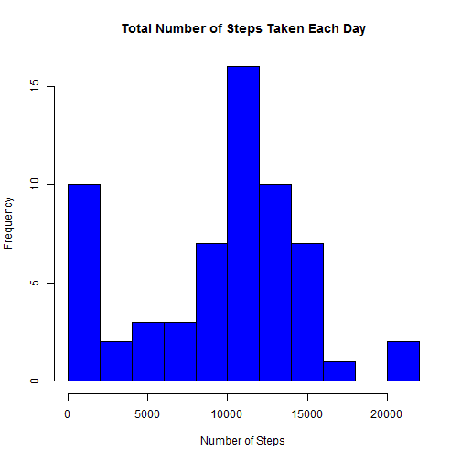
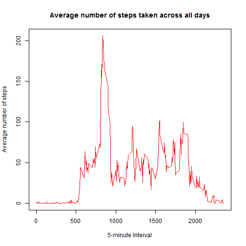
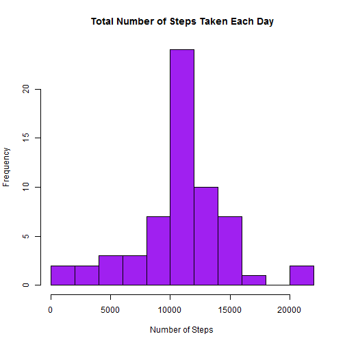
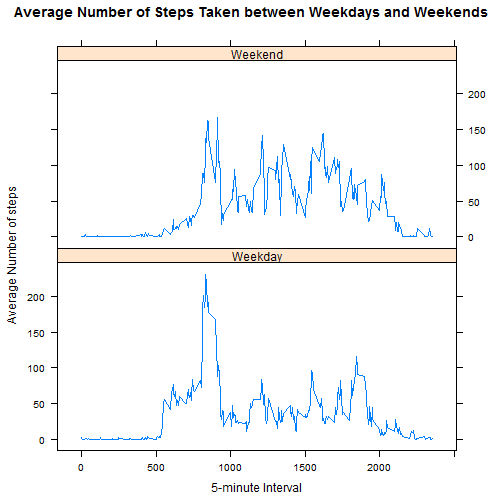

## Introduction
This assignment makes use of data from a personal activity monitoring
device. This device collects data at 5 minute intervals through out the
day. The data consists of two months of data from an anonymous
individual collected during the months of October and November, 2012
and include the number of steps taken in 5 minute intervals each day.

## Data
The variables included in this dataset are:

* **steps**: Number of steps taking in a 5-minute interval 

* **date**: The date on which the measurement was taken 

* **interval**: Identifier for the 5-minute interval in which
    measurement was taken

There are a total of 17,568 observations in this dataset.

### Loading and preprocessing the data
1. Load the data 

```r
activity_data <- read.csv("activity.csv", header=TRUE, sep=",", quote="\"'", na.strings = "NA")
head(activity_data)
```

```
##   steps       date interval
## 1    NA 2012-10-01        0
## 2    NA 2012-10-01        5
## 3    NA 2012-10-01       10
## 4    NA 2012-10-01       15
## 5    NA 2012-10-01       20
## 6    NA 2012-10-01       25
```
2. Process/transform the data (if necessary) into a format suitable for your analysis

```r
activity_data$date <- as.POSIXct(activity_data$date, format="%Y-%m-%d")
```

### What is mean total number of steps taken per day?
Fot this part, missing values are ignored in the dataset.

1. Calculate the total number of steps taken per day

```r
stepsperday <- aggregate(activity_data$steps, by = list(activity_data$date), sum, na.rm = TRUE)
names(stepsperday) <- c("date", "steps")
head(stepsperday)
```

```
##         date steps
## 1 2012-10-01     0
## 2 2012-10-02   126
## 3 2012-10-03 11352
## 4 2012-10-04 12116
## 5 2012-10-05 13294
## 6 2012-10-06 15420
```

2. Make a histogram of the total number of steps taken each day

```r
hist(stepsperday$steps, breaks=10, main = "Total Number of Steps Taken Each Day", xlab = "Number of Steps", col = "blue")
```

 

3. Calculate and report the mean and median of the total number of steps taken per day

```r
mean(stepsperday$steps)
```

```
## [1] 9354.23
```

```r
median(stepsperday$steps)
```

```
## [1] 10395
```

###What is the average daily activity pattern?
1. Make a time series plot (i.e. `type = "l"`) of the 5-minute interval (x-axis) and the average number of steps taken, averaged across all days (y-axis)

```r
daily_data <- aggregate(steps ~ interval, data = activity_data, mean, na.rm = TRUE)
head(daily_data)
```

```
##   interval     steps
## 1        0 1.7169811
## 2        5 0.3396226
## 3       10 0.1320755
## 4       15 0.1509434
## 5       20 0.0754717
## 6       25 2.0943396
```

```r
plot(daily_data$interval, daily_data$steps, type="l", col="red", lwd=1, xlab="5-minute Interval", ylab="Average number of steps", main="Average number of steps taken across all days")
```

 

2. Which 5-minute interval, on average across all the days in the dataset, contains the maximum number of steps?

```r
daily_data[which(daily_data$steps == max(daily_data$steps)), 1]
```

```
## [1] 835
```

### Imputing missing values
Note that there are a number of days/intervals where there are missing values (coded as `NA`). The presence of missing days may introduce bias into some calculations or summaries of the data

1. Calculate and report the total number of missing values in the dataset 

```r
sum(is.na(activity_data$steps))
```

```
## [1] 2304
```

2. Use the mean for that 5-minute interval for filling in all of the missing values in the dataset

```r
interval_data <- aggregate(steps ~ interval, data = activity_data, mean)
fill_data <- numeric()
for (i in 1:nrow(activity_data)) {
    subject <- activity_data[i, ]
    if (is.na(subject$steps)) {
        steps <- subset(interval_data, interval == subject$interval)$steps
    } else {
        steps <- subject$steps
    }
    fill_data <- c(fill_data, steps)
}
```

3. Create a new dataset that is equal to the original dataset but with the missing data filled in

```r
activity_new <- activity_data
activity_new$steps <- fill_data
head(activity_new)
```

```
##       steps       date interval
## 1 1.7169811 2012-10-01        0
## 2 0.3396226 2012-10-01        5
## 3 0.1320755 2012-10-01       10
## 4 0.1509434 2012-10-01       15
## 5 0.0754717 2012-10-01       20
## 6 2.0943396 2012-10-01       25
```

4. Make a histogram of the total number of steps taken each day and Calculate and report the **mean** and **median** total number of steps taken per day. Do these values differ from the estimates from the first part of the assignment? What is the impact of imputing missing data on the estimates of the total daily number of steps?

```r
stepsperday_new <- aggregate(steps ~ date, data = activity_new, sum)
hist(stepsperday_new$steps, breaks=10, main = "Total Number of Steps Taken Each Day", xlab = "Number of Steps", col = "purple")
```

 

```r
mean(stepsperday_new$steps)
```

```
## [1] 10766.19
```

```r
median(stepsperday_new$steps)
```

```
## [1] 10766.19
```
These values differ from the estimates before. Imputing missing data increasing the estimates of the total daily number of steps.

### Are there differences in activity patterns between weekdays and weekends?
For this part the `weekdays()` function may be of some help here. Use the dataset with the filled-in missing values for this part.

1. Create a new factor variable in the dataset with two levels -- "weekday" and "weekend" indicating whether a given date is a weekday or weekend day

```r
day <- weekdays(activity_new$date)
# Assign the day levels (weekend or weekday)
daylevel <- vector()
for (i in 1:nrow(activity_new)) {
    if (day[i] == "Saturday") {
        daylevel[i] <- "Weekend"
    } else if (day[i] == "Sunday") {
        daylevel[i] <- "Weekend"
    } else {
        daylevel[i] <- "Weekday"
    }
}
activity_new$daylevel <- daylevel
activity_new$daylevel <- factor(activity_new$daylevel)
head(activity_new)
```

```
##       steps       date interval daylevel
## 1 1.7169811 2012-10-01        0  Weekday
## 2 0.3396226 2012-10-01        5  Weekday
## 3 0.1320755 2012-10-01       10  Weekday
## 4 0.1509434 2012-10-01       15  Weekday
## 5 0.0754717 2012-10-01       20  Weekday
## 6 2.0943396 2012-10-01       25  Weekday
```

2.Make a panel plot containing a time series plot (i.e. `type = "l"`) of the 5-minute interval (x-axis) and the average number of steps taken, averaged across all weekday days or weekend days (y-axis)

```r
# Load the lattice library
library(lattice)
# Compute the average number of steps across daylevel
steps_Day <- aggregate(steps ~ interval + daylevel, data = activity_new, mean)
# Create the time series plot
xyplot(steps ~ interval | daylevel, data = steps_Day, type = "l", layout = c(1, 2), 
       xlab = "5-minute Interval", ylab = "Average Number of steps", 
       main = "Average Number of Steps Taken between Weekdays and Weekends")
```

 
